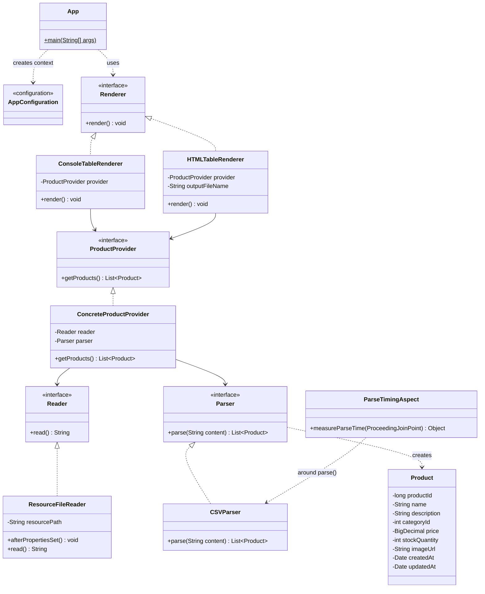

# Отчёт о лабораторной работе 2. Конфигурирование Spring с помощью аннотаций. AOP для логирования

## Цель работы

Перейти на конфигурирование приложения «Магазин зоотоваров» с помощью стереотипных аннотаций, вынести параметры в `application.properties`, добавить HTML-представление каталога, отследить инициализацию бина `ResourceFileReader` и измерить время парсинга CSV средствами AOP.

## Выполнение работы

1. Результат лабораторной работы № 1 скопирован в каталог `les06/lab/` (модуль Gradle `app`, пакет `ru.bsuedu.cad.lab`).
2. Java-конфигурация с `@Bean` заменена на сканирование компонентов: класс `AppConfiguration` содержит `@Configuration`, `@ComponentScan`, `@PropertySource`, `@EnableAspectJAutoProxy`. Все реализации помечены `@Component`.
3. Имя CSV-файла задаётся в `application.properties` (`products.filename`) и внедряется в `ResourceFileReader` через `@Value` и SpEL: `#{environment.getProperty('products.filename')}`.
4. Добавлен `HTMLTableRenderer` с аннотацией `@Primary` — при запуске используется он, а не `ConsoleTableRenderer`. Таблица сохраняется в HTML-файл (`products.html.output` в properties).
5. В `ResourceFileReader` реализован интерфейс `InitializingBean`; в методе `afterPropertiesSet()` в консоль выводится дата и время полной инициализации бина.
6. Аспект `ParseTimingAspect` с `@Around` замеряет время выполнения метода `CSVParser.parse()` и выводит результат в консоль.
7. Приложение запускается командой `./gradlew run` из каталога `les06/lab`.

### Структура проекта

```
les06/lab/
├── app/
│   ├── build.gradle.kts
│   └── src/main/
│       ├── java/ru/bsuedu/cad/lab/
│       │   ├── App.java
│       │   ├── AppConfiguration.java
│       │   ├── Product.java, Reader.java, Parser.java, ...
│       │   ├── aop/ParseTimingAspect.java
│       │   └── impl/
│       │       ├── ResourceFileReader.java
│       │       ├── CSVParser.java
│       │       ├── ConcreteProductProvider.java
│       │       ├── ConsoleTableRenderer.java
│       │       └── HTMLTableRenderer.java
│       └── resources/
│           ├── application.properties
│           └── product.csv
├── settings.gradle.kts
└── README.md
```

### UML-диаграмма классов



### Запуск

Перед первым запуском скопируйте Gradle Wrapper JAR из демо-проекта (если его ещё нет в `gradle/wrapper/`):

```bash
cp ../demo/gradle/wrapper/gradle-wrapper.jar gradle/wrapper/
chmod +x gradlew
```

Из каталога `les06/lab`:

```bash
./gradlew run
```

Пример вывода в консоль:

```
ResourceFileReader полностью инициализирован: 2026-06-04 22:30:15
Время парсинга CSV: 2 мс
HTML-таблица сохранена: /path/to/products.html
Количество товаров: 10
```

### Тесты

```bash
./gradlew test
```

## Выводы

Аннотационное конфигурирование (`@Component`, `@ComponentScan`, `@PropertySource`, `@Value`, SpEL) упрощает описание приложения по сравнению с явными `@Bean`-методами. Стереотип `@Primary` позволяет выбирать реализацию `Renderer` без изменения кода точки входа. События жизненного цикла (`InitializingBean`) и AOP (`@Aspect`, `@Around`) дают возможность добавлять сквозную функциональность (инициализация, замер времени) без изменения бизнес-логики парсера и провайдера данных.
