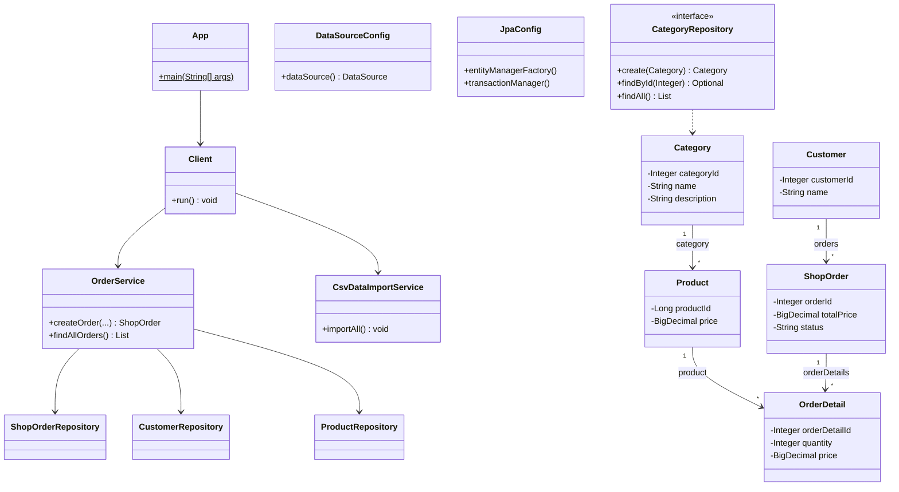

# Отчёт о лабораторной работе 4. JPA. Spring Data

## Цель работы

Рефакторинг приложения «Магазин зоотоваров» на Hibernate ORM и Spring Data JPA, выделение слоистой архитектуры и реализация создания заказа в транзакции.

## Выполнение работы

1. Проект создан заново в `les08/lab/` (модуль Gradle `app`).
2. `DataSource` на H2 через `HikariDataSource`; схема генерируется Hibernate (`hbm2ddl.auto=create-drop`).
3. Структура пакетов: `entity`, `repository`, `service`, `app`; конфигурация в `ru.bsuedu.cad.lab`.
4. JPA-сущности: `Category`, `Product`, `Customer`, `ShopOrder`, `OrderDetail` по ER-схеме задания.
5. Репозитории Spring Data JPA с методами `create`, `findById`, `findAll` для каждой сущности.
6. `OrderService` — создание заказа и получение списка заказов; `CsvDataImportService` — загрузка данных из CSV.
7. `Client` импортирует CSV, создаёт заказ в транзакции, логирует результат и читает заказ из БД по id.
8. Запуск: `./gradlew run` из `les08/lab`.

Файлы `category.csv`, `product.csv`, `customer.csv` и `logback.xml` **копируются** в проект (исходники в `les08/assets/` и `les08/demo/` остаются на месте):

```bash
cp ../assets/category.csv app/src/main/resources/
cp ../assets/product.csv app/src/main/resources/
cp ../assets/customer.csv app/src/main/resources/
cp ../demo/app/src/main/resources/logback.xml app/src/main/resources/
```

### Структура проекта

```
les08/lab/
├── app/
│   └── src/main/java/ru/bsuedu/cad/lab/
│       ├── DataSourceConfig.java, JpaConfig.java
│       ├── entity/
│       ├── repository/
│       ├── service/
│       ├── app/
│       └── resources/
│           ├── category.csv, product.csv, customer.csv
│           └── logback.xml
└── README.md
```

### UML-диаграмма классов



### Запуск

```bash
cp ../demo/gradle/wrapper/gradle-wrapper.jar gradle/wrapper/
chmod +x gradlew
./gradlew run
```

## Выводы

Spring Data JPA сокращает объём JDBC-кода: репозитории предоставляют CRUD, Hibernate управляет схемой и связями. Слоистая архитектура отделяет сущности, доступ к данным, бизнес-логику и точку входа. `@Transactional` гарантирует атомарность создания заказа с позициями.
