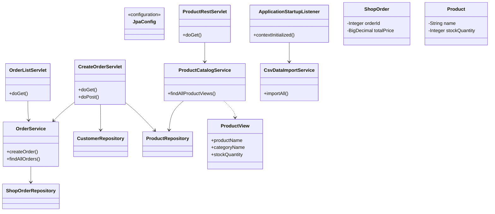

# Отчёт о лабораторной работе 5. Разработка и развёртывание Web-приложений

## Цель работы

Добавить Web-интерфейс к приложению «Магазин зоотоваров» на базе лабораторной работы №4: сервлеты для заказов, REST API для товаров, сборка WAR и деплой на Apache Tomcat 11.

## Выполнение работы

1. На основе lab 4 (`les08/lab`) создан Web-проект в `les10/lab/` со слоями `entity`, `repository`, `service`, `servlet`, `listener`, `web`.
2. Apache Tomcat 11: установка, настройка пользователя-администратора (см. ниже).
3. Сборка WAR: плагин `war`, команда `./gradlew war`, файл `app/build/libs/pet-shop.war`.
4. `OrderListServlet` (`/orders`) — таблица заказов и ссылка на создание заказа.
5. `CreateOrderServlet` (`/orders/new`) — форма создания заказа, после POST — редирект на список.
6. `ProductRestServlet` (`/api/products`) — JSON: название товара, категория, остаток на складе.
7. Spring Context через `ContextLoaderListener` и `web.xml`; импорт CSV при старте (`ApplicationStartupListener`).
8. Деплой WAR в Tomcat, проверка REST в Postman.

CSV-файлы в `app/src/main/resources/` подготовлены по данным из `les08/assets/` (исходники в `les08` не изменяются). При обновлении данных:

```bash
cp ../../les08/assets/category.csv app/src/main/resources/
cp ../../les08/assets/product.csv app/src/main/resources/
cp ../../les08/assets/customer.csv app/src/main/resources/
```

### Структура проекта

```
les10/lab/
├── app/
│   ├── build.gradle.kts
│   ├── src/main/
│   │   ├── java/ru/bsuedu/cad/lab/
│   │   │   ├── entity/
│   │   │   ├── repository/
│   │   │   ├── service/
│   │   │   ├── servlet/
│   │   │   ├── listener/
│   │   │   └── web/
│   │   ├── resources/
│   │   └── webapp/WEB-INF/web.xml
└── README.md
```

### UML-диаграмма классов



### Apache Tomcat 11

1. Скачайте Tomcat 11 с https://tomcat.apache.org/ и распакуйте.
2. Добавьте пользователя-администратора в `conf/tomcat-users.xml`:

```xml
<role rolename="admin-gui"/>
<role rolename="admin-script"/>
<user username="admin" password="admin" roles="admin-gui,admin-script"/>
```

3. Запустите Tomcat: `./bin/catalina.sh run` (macOS/Linux) или `catalina.bat run` (Windows).

### Сборка и деплой

```bash
cd les10/lab
cp ../demo/gradle/wrapper/gradle-wrapper.jar gradle/wrapper/
chmod +x gradlew
./gradlew war
cp app/build/libs/pet-shop.war $CATALINA_HOME/webapps/
```

Приложение доступно по адресу: http://localhost:8080/pet-shop/

### Проверка

| URL | Описание |
|-----|----------|
| `/pet-shop/orders` | Список заказов |
| `/pet-shop/orders/new` | Форма нового заказа |
| `/pet-shop/api/products` | REST JSON (GET, Postman) |

Пример ответа REST:

```json
[
  {
    "productName": "Сухой корм для собак",
    "categoryName": "Корма",
    "stockQuantity": 50
  }
]
```

## Выводы

Консольное приложение lab 4 расширено Web-слоем на сервлетах и Spring Context в Tomcat. WAR упаковывает JPA-логику и статические ресурсы; REST-сервис отдаёт каталог товаров в JSON для внешних клиентов. Разделение на сервлеты, сервисы и репозитории сохраняет слоистую архитектуру при переходе на Web.
