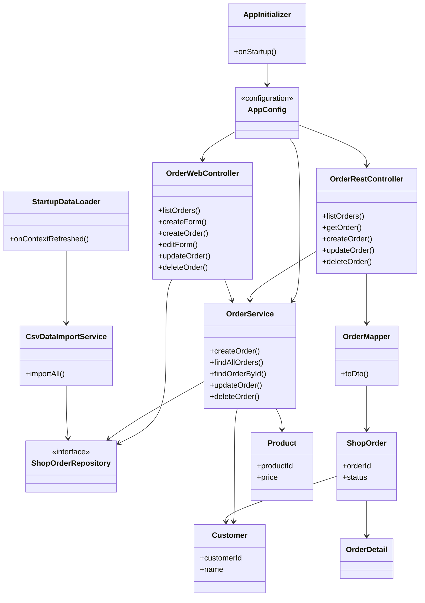

# Отчёт о лабораторной работе 6. Web-приложение на Spring MVC

## Цель работы

Перевести приложение «Магазин зоотоваров» с сервлетов (лабораторная работа №5) на Spring MVC: REST API заказов, Web-интерфейс на Thymeleaf, сборка WAR и деплой на Apache Tomcat 11.

## Выполнение работы

1. На основе lab 5 (`les10/lab`) создан проект в `les12/lab/` со слоями `entity`, `repository`, `service`, `controller`, `config`, `dto`, `web`. Сервлеты и `web.xml` заменены на `WebApplicationInitializer` и `DispatcherServlet`.
2. Настроен Spring MVC: `@EnableWebMvc`, `AppInitializer`, единый контекст Spring с JPA и транзакциями.
3. REST API заказов (`OrderRestController`, `/api/orders`): список, получение по id, создание, изменение, удаление.
4. Коллекция Postman: `postman/pet-shop-orders.postman_collection.json`. Базовый URL: `http://localhost:8080/pet-shop` (имя контекста зависит от имени WAR).
5. Thymeleaf: страницы списка, создания и редактирования заказов (`/orders`, `/orders/new`, `/orders/{id}/edit`).
6. Сборка: `./gradlew war` → `app/build/libs/pet-shop.war`.
7. Деплой: скопировать WAR в `webapps` Tomcat 11, запустить сервер, проверить REST в Postman и UI в браузере.

CSV-файлы в `app/src/main/resources/` соответствуют данным из `les08/assets/`. При обновлении:

```bash
cp ../../les08/assets/category.csv app/src/main/resources/
cp ../../les08/assets/product.csv app/src/main/resources/
cp ../../les08/assets/customer.csv app/src/main/resources/
```

Если отсутствует `gradle/wrapper/gradle-wrapper.jar`:

```bash
cp ../../les10/lab/gradle/wrapper/gradle-wrapper.jar gradle/wrapper/
cp ../../les10/lab/gradlew .
chmod +x gradlew
```

### Структура проекта

```
les12/lab/
├── app/
│   ├── build.gradle.kts
│   └── src/main/
│       ├── java/ru/bsuedu/cad/lab/
│       │   ├── config/
│       │   ├── controller/
│       │   ├── dto/
│       │   ├── entity/
│       │   ├── repository/
│       │   ├── service/
│       │   └── web/
│       └── resources/
│           ├── templates/orders/
│           ├── db/jdbc.properties
│           └── *.csv
├── postman/
│   └── pet-shop-orders.postman_collection.json
└── README.md
```

### UML-диаграмма классов



### REST API

| Метод  | URL                 | Описание              |
|--------|---------------------|-----------------------|
| GET    | `/api/orders`       | Список заказов        |
| GET    | `/api/orders/{id}`  | Заказ по id           |
| POST   | `/api/orders`       | Создание заказа       |
| PUT    | `/api/orders/{id}`  | Изменение заказа      |
| DELETE | `/api/orders/{id}`  | Удаление заказа       |

Пример тела POST:

```json
{
  "customerId": 1,
  "shippingAddress": "Москва, ул. Ленина, д. 10",
  "lines": [
    { "productId": 1, "quantity": 2 }
  ]
}
```

### Web-интерфейс

| URL                    | Действие                    |
|------------------------|-----------------------------|
| `/`                    | Редирект на список заказов  |
| `/orders`              | Список заказов              |
| `/orders/new`          | Форма создания              |
| `/orders/{id}/edit`    | Форма изменения             |
| POST `/orders/{id}/delete` | Удаление заказа         |

### Сборка и деплой

```bash
cd les12/lab
./gradlew war
```

Скопировать `app/build/libs/pet-shop.war` в каталог `webapps` Tomcat 11. После старта:

- UI: http://localhost:8080/pet-shop/orders
- REST: http://localhost:8080/pet-shop/api/orders

Импорт коллекции Postman: File → Import → `postman/pet-shop-orders.postman_collection.json`.
