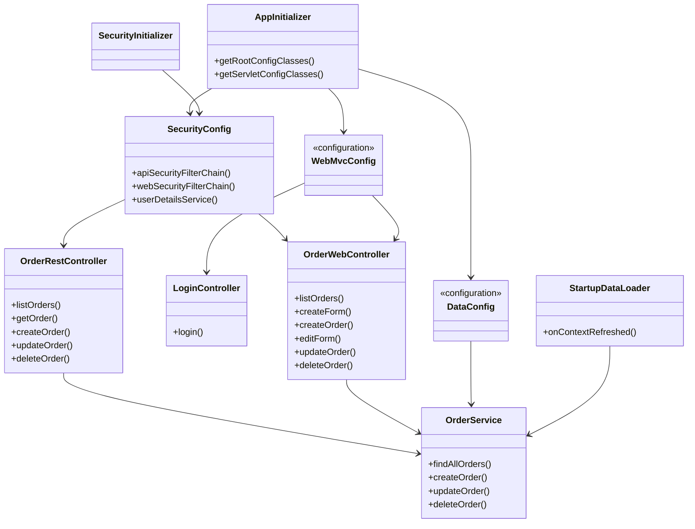

# Отчёт о лабораторной работе 7. Spring Security

## Цель работы

Добавить в приложение «Магазин зоотоваров» (на базе лабораторной работы №6) аутентификацию и авторизацию: роли `user` и `manager`, form login для Web-интерфейса, Basic Authentication для REST API.

## Выполнение работы

1. На основе lab 6 (`les12/lab`) создан проект в `les14/lab/` с разделением конфигурации на `DataConfig`, `WebMvcConfig`, `SecurityConfig`, инициализаторы `AppInitializer`, `SecurityInitializer`.
2. Подключён Spring Security 6: две цепочки `SecurityFilterChain` - для `/api/**` и для Web-части.
3. Пользователи в памяти (`InMemoryUserDetailsManager`):
   - `user` / `user` - роль `USER`: только просмотр заказов;
   - `manager` / `manager` - роль `MANAGER`: все операции с заказами.
4. Form login: страница `/login`, доступ к `/orders` (GET) для `USER` и `MANAGER`, создание/изменение/удаление - только `MANAGER`. Basic Authentication на Web-цепочке отключён.
5. Basic Authentication для `/api/**`: GET - `USER` и `MANAGER`, POST/PUT/DELETE - только `MANAGER`. Form login на API-цепочке отключён.
6. Сборка: `./gradlew war` -> `app/build/libs/pet-shop.war`.
7. Деплой на Tomcat 11, проверка UI и REST (Postman).

### Пользователи и права

| Логин    | Пароль   | Роль    | Web (form login)              | REST (Basic Auth)        |
|----------|----------|---------|-----------------------------|--------------------------|
| user     | user     | USER    | Просмотр списка заказов     | GET `/api/orders`        |
| manager  | manager  | MANAGER | Все операции с заказами     | Все операции с заказами  |

### Структура проекта

```
les14/lab/
├── app/
│   ├── build.gradle.kts
│   └── src/main/
│       ├── java/ru/bsuedu/cad/lab/
│       │   ├── config/
│       │   ├── controller/
│       │   ├── dto/
│       │   ├── entity/
│       │   ├── repository/
│       │   ├── service/
│       │   ├── web/
│       │   ├── AppInitializer.java
│       │   └── SecurityInitializer.java
│       └── resources/
│           ├── templates/
│           └── *.csv
├── postman/
│   └── pet-shop-orders.postman_collection.json
└── README.md
```

### UML-диаграмма классов



### Сборка и деплой

```bash
cd les14/lab
cp ../../les12/lab/gradle/wrapper/gradle-wrapper.jar gradle/wrapper/ 2>/dev/null || cp ../../les10/lab/gradle/wrapper/gradle-wrapper.jar gradle/wrapper/
cp ../../les12/lab/gradlew . 2>/dev/null || cp ../../les10/lab/gradlew .
chmod +x gradlew
./gradlew war
```

Скопировать `app/build/libs/pet-shop.war` в `webapps` Tomcat 11.

### Проверка Web-интерфейса

1. Открыть http://localhost:8080/pet-shop/ - редирект на `/login`.
2. Войти как `user` / `user` - доступен список заказов без кнопок изменения.
3. Войти как `manager` / `manager` - доступны создание, изменение и удаление заказов.

### Проверка REST API

Импортировать `postman/pet-shop-orders.postman_collection.json` в Postman.

- GET с Basic `user:user` - 200 OK.
- POST с Basic `user:user` - 403 Forbidden.
- POST/PUT/DELETE с Basic `manager:manager` - успешный ответ при корректных данных.

Базовый URL: `http://localhost:8080/pet-shop`.
