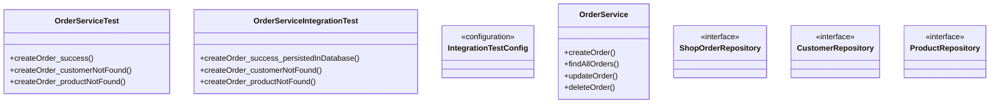

# Отчёт о лабораторной работе 8. Основы тестирования

## Цель работы

Добавить к приложению «Магазин зоотоваров» (на базе лабораторной работы №6) модульные и интеграционные тесты для `OrderService.createOrder`, а также отчёт о покрытии кода JaCoCo.

## Выполнение работы

1. На основе lab 6 (`les12/lab`) создан проект в `les16/lab/` с REST API, Thymeleaf UI и слоями `entity`, `repository`, `service`, `controller`.
2. Настроены unit-тесты: JUnit 5, Mockito, AssertJ, `spring-test`.
3. Подключён плагин JaCoCo, отчёт формируется после `./gradlew test`.
4. `OrderServiceTest` - unit-тесты `createOrder`: успешное создание, клиент не найден, товар не найден (моки репозиториев).
5. Запуск unit-тестов: `./gradlew test`.
6. Настроены интеграционные тесты: Spring Test Context, H2 in-memory, `IntegrationTestConfig`.
7. `OrderServiceIntegrationTest` - интеграция `OrderService` с репозиториями: успешное сохранение заказа в БД, ошибки при отсутствии клиента и товара.
8. Повторный запуск: `./gradlew test jacocoTestReport`.

### Структура тестов

```
les16/lab/app/src/test/java/ru/bsuedu/cad/lab/
├── config/
│   └── IntegrationTestConfig.java
└── service/
    ├── OrderServiceTest.java
    └── OrderServiceIntegrationTest.java
```

### Unit-тесты (`OrderServiceTest`)

| Тест | Описание |
|------|----------|
| `createOrder_success` | Клиент и товар найдены, заказ сохранён, сумма рассчитана |
| `createOrder_customerNotFound` | `IllegalArgumentException`, репозиторий заказов не вызывается |
| `createOrder_productNotFound` | `IllegalArgumentException`, репозиторий заказов не вызывается |

Зависимости изолированы заглушками Mockito.

### Интеграционные тесты (`OrderServiceIntegrationTest`)

| Тест | Описание |
|------|----------|
| `createOrder_success_persistedInDatabase` | Заказ записан в H2, проверка суммы и позиций |
| `createOrder_customerNotFound` | Исключение, таблица заказов пуста |
| `createOrder_productNotFound` | Исключение, таблица заказов пуста |

Используется реальный Spring-контекст JPA и встраиваемая БД H2 (`jdbc:mem:petshop_test`).

### JaCoCo

После выполнения тестов HTML-отчёт:

```
app/build/reports/jacoco/index.html
```

Команды:

```bash
cd les16/lab
./gradlew test
./gradlew jacocoTestReport
```

### UML-диаграмма классов



### Сборка приложения

```bash
./gradlew war
```

WAR: `app/build/libs/pet-shop.war`.
